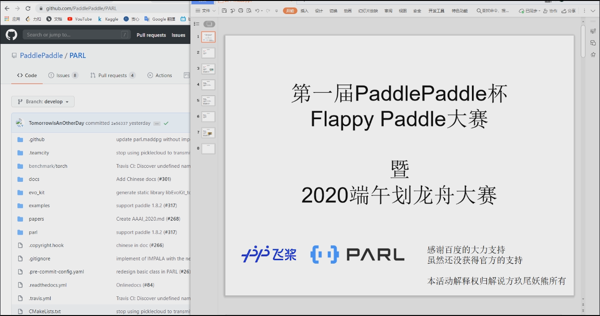
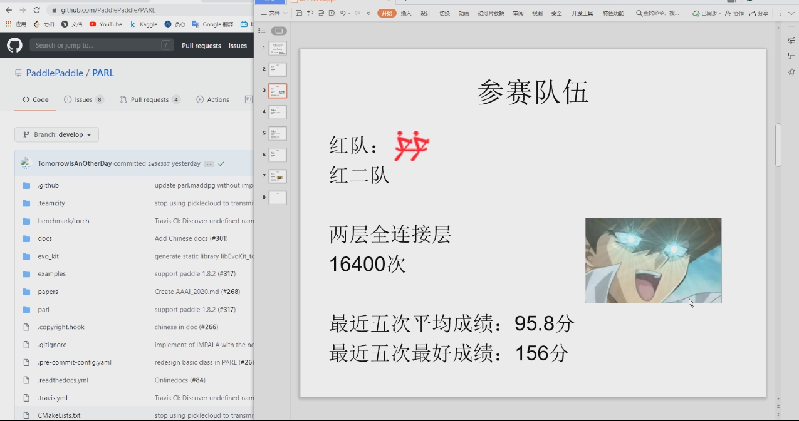
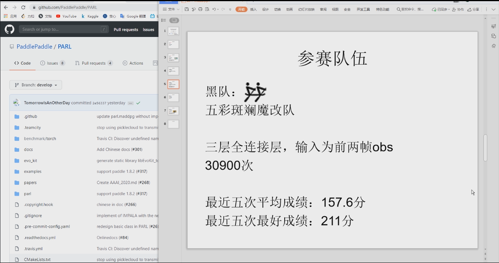
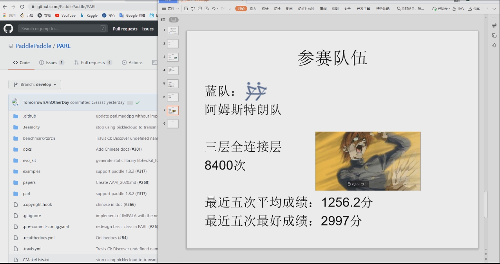
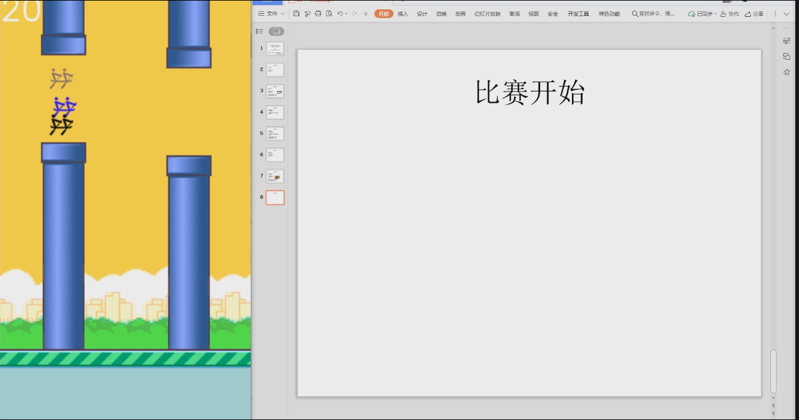
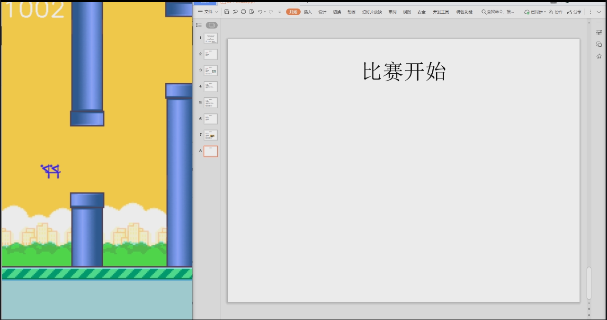

# FlappyPaddle

预览视频看这里：

[第一届Flappy Paddle大赛](https://www.bilibili.com/video/BV1KV411674k) 从一分五十秒开始比赛

## 训练了三个

1. 两个hidden layer （modelsm_16400_95.8.ckpt）
2. 三个hidden layer （model3_8400_1256.2.ckpt）
3. 三个hidden layer+前两帧的obs直接concat作为输入（modelconcat_30900_157.6.ckpt）

## 环境

修改了flappy game的init，可以直接跑三个agent了，所以如果你想在环境中评比几个算法现在也是可行的了

提供三种颜色队伍的图片

以上都按照环境本来的文件夹格式提供。

## 所以你也可以和我一起比，修改run3Agent中添加你的model、algorithm、agent,你一定可以看懂。

## 【BUG】：

​	不知道啥情况，第一个agent操作了第二个队伍，第二个agent操作第一个队伍，还在排查中

## 第一届paddlepaddle杯Flappy Paddle大赛

最后的比赛成绩红队143分，黑队125分，蓝队1003分

